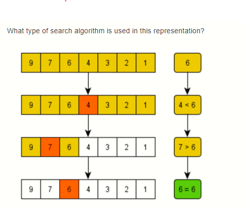
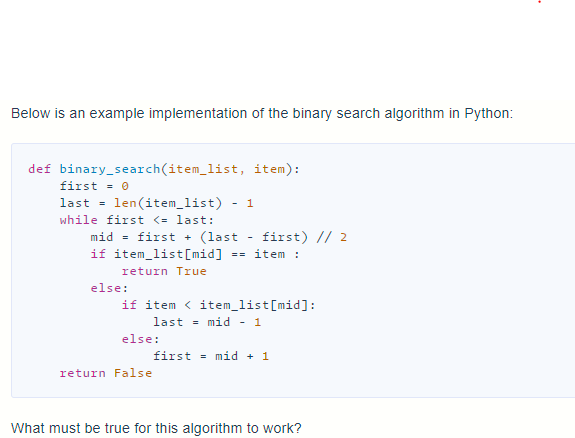

## Which logarithmic expression is identical to the following exponential expression?
>2^n = 64
> log_2(64)=n

# Binary Search

 
# item_list must be sorted from least to greatest.

---

For a given positive integer `n` determine if it can be represented as a sum of two [Fibonacci numbers](keyword://fibonacci-sequence) (possibly equal).

Example

-   For `n = 1`, the output should be\
    `fibonacciSimpleSum2(n) = true`.

    Explanation: `1 = 0 + 1 = F~0~ + F~1~`.

-   For `n = 11`, the output should be\
    `fibonacciSimpleSum2(n) = true`.

    Explanation: `11 = 3 + 8 = F~4~ + F~6~`.

-   For `n = 60`, the output should be\
    `fibonacciSimpleSum2(n) = true`.

    Explanation: `60 = 5 + 55 = F~5~ + F~10~`.

-   For `n = 66`, the output should be\
    `fibonacciSimpleSum2(n) = false`.

Input/Output

-   [execution time limit] 4 seconds (py3)

-   [input] integer n

    *Guaranteed constraints:*\
    `1 ≤ n ≤ 2 - 10^9^`.

-   [output] boolean

    `true` if `n` can be represented as `F~i~ + F~j~`, `false` otherwise.

